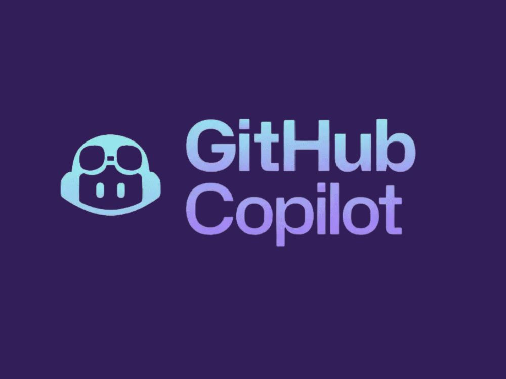

# GitHub Copilot Enterprise Hackathon



Welcome to the GitHub Copilot Enterprise 1-Day Hackathon! This repository contains **5 role-based tracks** with hands-on challenges designed to help teams across your organization master GitHub Copilot's powerful features.

## Hackathon Overview

This hackathon is organized into **role-based tracks** for different team types, plus a **bonus track** for advanced participants:

### Choose Your Track

- **[Backend Developer Track](./tracks/backend-developer-track.md)** - REST APIs, authentication, testing
- **[Data Science & ML Track](./tracks/data-science-ml-track.md)** - Data analysis, ML models, feature engineering
- **[DevOps & Platform Track](./tracks/devops-platform-track.md)** - Infrastructure as Code, containers, CI/CD
- **[Frontend Developer Track](./tracks/frontend-developer-track.md)** - React, TypeScript, modern UI
- **[QA Tester Track](./tracks/qa-tester-track.md)** - Test automation, quality assurance, comprehensive testing
- **[Bonus: Copilot Extensions Track](./tracks/bonus-copilot-extensions-track.md)** - Build a Copilot Extension agent (advanced)
- **[Bonus: Flight Delay Predictor Track](./tracks/bonus-flight-delay-track.md)** - Full-stack ML app (advanced)

**[View All Tracks & Choose Yours](./tracks/README.md)**

Each track provides a curated path through the challenges based on your role, with specific guidance, tips, and learning objectives.

## Duration

**6-8 hours** per track.

## Getting Started

### Step 1: Choose Your Track

**Not sure which track?** See the **[Track Selection Guide](./tracks/README.md)** for help choosing.

### Step 2: Set Up Environment

#### Prerequisites

- GitHub account with Copilot access
- GitHub Codespaces enabled (recommended) OR
- Local development environment with VS Code and GitHub Copilot extension

#### Start Hacking

**Option A: GitHub Codespaces (Recommended)**

1. Click the green **"Code"** button at the top of this repository.
2. Select the **"Codespaces"** tab.
3. Click **"Create codespace on main"**.
4. Wait for the environment to set up (2-3 minutes).

**Option B: Local Development**

1. Clone this repository:

   ```bash
   git clone https://github.com/martaldsantos/gh-copilot-for-enterprise.git
   cd gh-copilot-for-enterprise

   ```

2. Open the folder in VS Code.
3. When prompted, click **"Reopen in Container"** (requires Docker and Dev Containers extension).

The environment is pre-configured with:

- Node.js (LTS)
- Python 3.11
- Docker
- Terraform
- kubectl
- All necessary VS Code extensions

### Step 3: Configure Copilot Context (CRITICAL)

The file `.github/copilot-instructions.md` currently contains instructions for the hackathon organizers. **You must overwrite this file** with instructions relevant to your specific project.

1. Open `.github/copilot-instructions.md`.
2. **Delete its entire contents.**
3. Add instructions specific to your challenge (see your Track guide for examples).
4. Save the file.

> **Why?** If you don't do this, Copilot will think it's helping organize a hackathon instead of helping you write code!

### Step 4: Verify Your Setup

Before starting, make sure Copilot is working:

**Check Copilot Status:**

- Look at the bottom-right of VS Code
- Copilot icon should be visible and say "Ready"

**Test Inline Suggestions:**

1. Create a new file (e.g., `test.js`)
2. Type: `// function to add two numbers`
3. You should see Copilot suggestions appear!

**Test Chat:**

1. Press `Ctrl+Shift+I` (Windows/Linux) or `Cmd+Shift+I` (Mac)
2. Type: "Hello, are you working?"
3. Copilot should respond!

### Step 5: Start Your Track

Once your environment is ready:

1. Open your chosen track guide (e.g., `tracks/backend-developer-track.md`)
2. Follow the recommended challenge sequence
3. Use the track-specific tips and guidance

## Key GitHub Copilot Features You'll Learn

Throughout these challenges, you'll master:

### 1. **Chat & Agentic Capabilities**

- `/explain`, `/fix`, `/tests` commands
- **Agentic Mode** - Autonomous multi-step task execution
- **Planning Mode** - High-level architectural reasoning
- Workspace context chat

### 2. **Prompt Engineering**

- Effective prompt patterns
- Context-aware requests
- Iterative refinement
- Collections and reusable prompts

### 3. **Extensibility & Custom Agents**

- **MCP Servers** - Connect external tools and data
- **Custom Agents** - Build and use specialized assistants
- Enhanced context for Copilot

### 4. **Inline Suggestions**

- Code completion
- Multi-line suggestions
- Ghost text navigation

## Challenges

** Tip:** Instead of choosing challenges individually, we recommend following a [role-based track](./tracks/README.md) for a structured learning experience!

All 5 challenges are available, and each track has a dedicated challenge:

### [Challenge 1: Web Development - REST API Builder](./challenges/challenge-1-web-api/)

**Team**: Backend/Web Developers
**Skills**: Express.js/FastAPI, API design, error handling, testing
**Copilot Focus**: Inline completion, `/tests` command, workspace chat

Build a fully functional REST API with authentication, CRUD operations, and comprehensive testing using Copilot to accelerate development.

---

### [Challenge 2: ML/AI - Data Analysis & Model Development](./challenges/challenge-2-ml-ai/)

**Team**: Data Scientists, ML Engineers
**Skills**: Python, pandas, scikit-learn, data visualization
**Copilot Focus**: Jupyter notebooks integration, `/explain` for algorithms, code generation

Perform exploratory data analysis and build a machine learning model with Copilot assisting in data processing, feature engineering, and model selection.

---

### [Challenge 3: DevOps - Infrastructure as Code](./challenges/challenge-3-devops/)

**Team**: DevOps, Platform Engineers
**Skills**: Terraform, Docker, Kubernetes, CI/CD
**Copilot Focus**: Infrastructure patterns, documentation generation, best practices

Design and implement cloud infrastructure using Terraform, containerize applications, and set up deployment pipelines with Copilot's infrastructure expertise.

---

### [Challenge 4: Frontend - Interactive UI Components](./challenges/challenge-4-frontend/)

**Team**: Frontend Developers
**Skills**: React, TypeScript, Component design, State management
**Copilot Focus**: Component scaffolding, TypeScript types, CSS styling

Create a modern, responsive web application with reusable components, leveraging Copilot for rapid prototyping and TypeScript type safety.

---

### [Challenge 5: QA & Test Automation](./challenges/challenge-5-qa/)

**Team**: QA Engineers, SDETs, Test Automation Engineers
**Duration**: 4-6 hours (extended challenge with real-world apps)
**Skills**: Playwright, Jest/Pytest, Page Object Model, E2E testing
**Copilot Focus**: Test generation with `/tests`, Playwright MCP for AI-driven testing

Work with real-world open-source applications to implement comprehensive test automation, including unit tests, E2E tests with Playwright, and AI-driven testing using Playwright MCP.

---

### [Bonus Challenge 6: Copilot Extensions -- Team Standup Bot](./challenges/challenge-6-copilot-extensions/)

**Team**: Experienced developers (any role) who finished a standard track
**Duration**: 8-12 hours (Advanced)
**Skills**: Node.js, Express, Copilot Extensions SDK, GitHub API, Server-Sent Events
**Copilot Focus**: Building an extension *for* Copilot -- request verification, SSE responses, LLM prompting, function calling

Build a fully functional Copilot Extension agent -- a Team Standup & Project Tracker Bot that users invoke via `@standup-bot` in Copilot Chat. Integrates with GitHub APIs for project awareness and uses AI for blocker analysis and report generation.

> ⚠️ **Bonus challenge** -- significantly harder and longer than standard challenges.

---

### [Challenge 7: Bonus -- Full-Stack Flight Delay Predictor](./challenges/challenge-7-flight-delay/)

**Team**: Full-Stack Developers, Advanced Participants
**Duration**: 8-12 hours (extended bonus challenge)
**Skills**: Python, pandas, scikit-learn, Flask/FastAPI, TypeScript, frontend frameworks
**Copilot Focus**: End-to-end development -- data science in notebooks, API scaffolding, frontend generation, cross-domain debugging

Build a complete application that predicts flight delay probability. Explore a real FAA dataset, train an ML model, serve it through a REST API, and create a frontend where users select a day and airport to see their delay risk.

---

## Learning Resources

### Examples & Templates

> **[github/awesome-copilot](https://github.com/github/awesome-copilot)** - A curated collection of real-world examples including:
> - Custom instruction files (`.github/copilot-instructions.md`)
> - Custom agent templates (`.github/agents/`)
> - Reusable prompt files (`.github/prompts/`)
> - Best practices and patterns

### GitHub Copilot Documentation

- [Copilot Guide](./docs/copilot-guide.md)
- [Prompt Engineering Guide](./docs/prompt-engineering.md)
- [MCP Servers Guide](./docs/mcp-servers.md)

### Quick Tips

** Maximize Your Copilot Experience:**

1. **Be Specific**: Detailed prompts yield better results
2. **Provide Context**: Reference existing code and patterns
3. **Iterate**: Refine suggestions through conversation
4. **Use Chat Commands**: Leverage `/explain`, `/fix`, `/tests`, and natural language for documentation
5. **Review Suggestions**: Always understand generated code
6. **Keyboard Shortcuts**:
 - `Tab` - Accept suggestion
 - `Esc` - Dismiss suggestion
 - `Alt+]` - Next suggestion
 - `Alt+[` - Previous suggestion
 - `Ctrl+Shift+I` - Open Copilot Chat

### Tips for Success

1. **Write Clear Comments**

   ```javascript
   // ❌ Bad: "do stuff"
   // ✅ Good: "Validate email format and return true if valid, false otherwise"

   ```

2. **Use Chat Freely** - Ask Copilot: "What does this code do?", "How can I improve this?"

3. **Review Everything** - Understand all generated code, test thoroughly

4. **Iterate** - First suggestion not perfect? Refine your prompt or try different approaches

### Common Issues

| Problem | Solution |
|---------|----------|
| Copilot not suggesting | Check status icon, ensure signed in, restart VS Code |
| Wrong suggestions | Be more specific, provide more context, try chat instead |
| Environment issues | Codespaces: rebuild container; Local: check tool versions |

## Hackathon Format

### Track-Based Learning (Recommended)

**Choose a track** based on your role and follow the curated path:

- Each track provides a recommended sequence of challenges
- Track-specific tips and guidance
- Clear learning objectives
- Estimated time for completion

See **[Tracks Overview](./tracks/README.md)** to choose your path.

### Alternative: Individual Challenges

Prefer to explore on your own?

- Choose 2-3 challenges based on your interests
- Each challenge includes starter code and objectives
- Progressive difficulty with bonus tasks

### Team Showcase (1-2 hours)

- Present your solutions
- Share interesting Copilot interactions
- Discuss productivity gains and learnings
- Compare experiences across different tracks

### Best Practices Session (1 hour)

- Review common patterns
- Share tips and tricks discovered
- Q&A with Copilot experts

## Success Metrics

Track your progress:

- [ ] Chose and started your track
- [ ] Completed at least 2 challenges (or all required challenges in your track)
- [ ] Used all major chat commands (`/explain`, `/fix`, `/tests`)
- [ ] Created reusable prompt collections
- [ ] Documented learnings and productivity wins
- [ ] Can explain Copilot's impact on your workflow

## Collaboration

- Use GitHub Issues to ask questions
- Share discoveries in Discussions
- Help teammates learn new Copilot features
- Document your journey in your challenge folders

## Feedback

After completing the hackathon, please share:

- What worked well
- What could be improved
- Productivity improvements you experienced
- Features you found most valuable

## Next Steps

After the hackathon:

1. Apply Copilot to your daily work
2. Explore advanced features and settings
3. Create team-specific prompt collections
4. Share knowledge with your organization
5. Measure and track productivity improvements

## Support & Resources

### Quick Links

- **[Choose Your Track](./tracks/README.md)** - Role-based learning paths
- **[Troubleshooting Guide](./TROUBLESHOOTING.md)** - Common issues and solutions
- **[Facilitator Guide](./FACILITATOR_GUIDE.md)** - For hackathon organizers
- **[Contributing Guide](./CONTRIBUTING.md)** - Help improve this content

### Need Help?

- **Which track?** See [Track Selection Guide](./tracks/README.md)
- **Technical Issues**: Check [Troubleshooting Guide](./TROUBLESHOOTING.md)
- **Copilot Questions**: Use Copilot Chat in VS Code
- **General Help**: Review the `/docs` folder
- **Found a Bug**: Create an issue in this repository

---

**Getting started:**

1. [Choose Your Track](./tracks/README.md)
2. Follow the [Setup Instructions](#step-2-set-up-environment) above
3. [Verify Your Setup](#step-4-verify-your-setup)
4. Start your first challenge!
